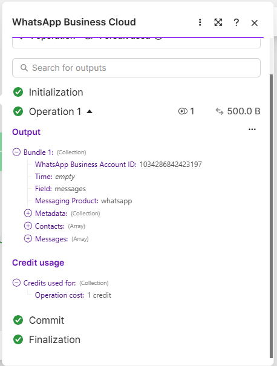
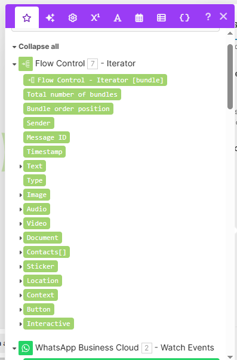
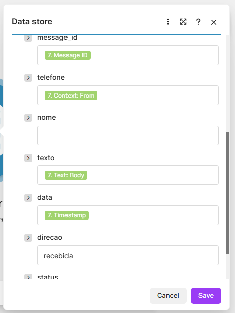
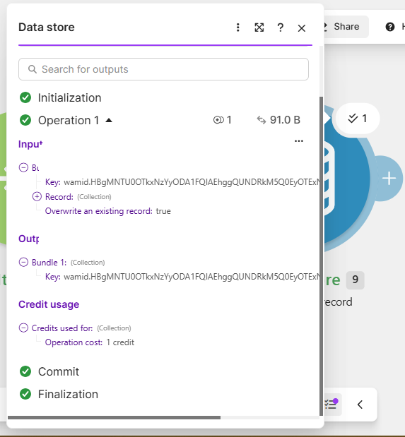
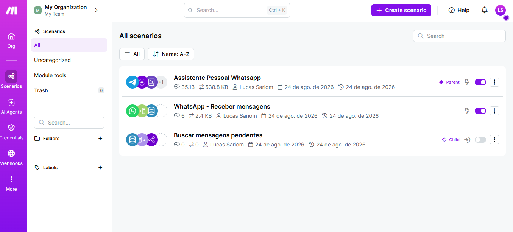
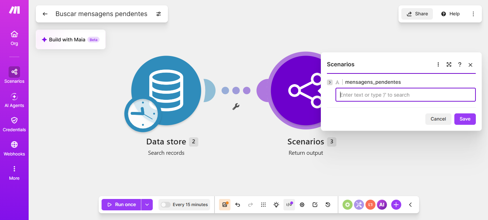
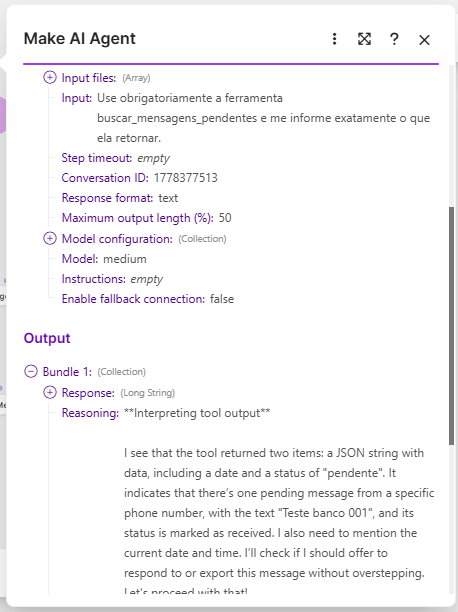
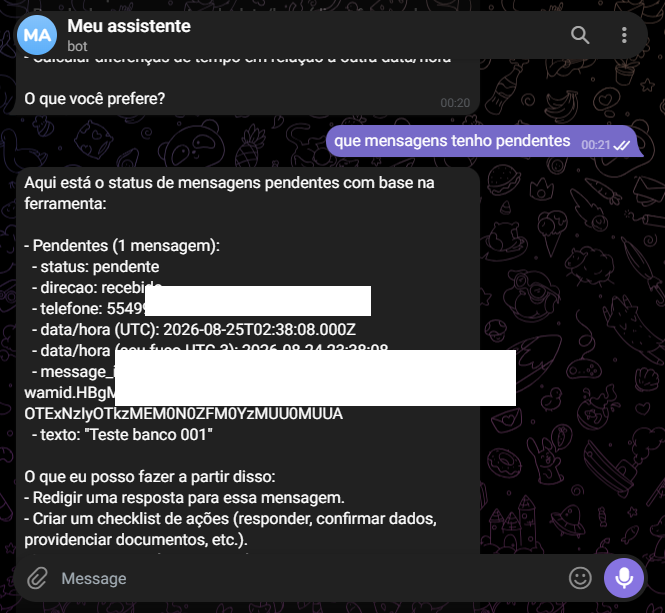
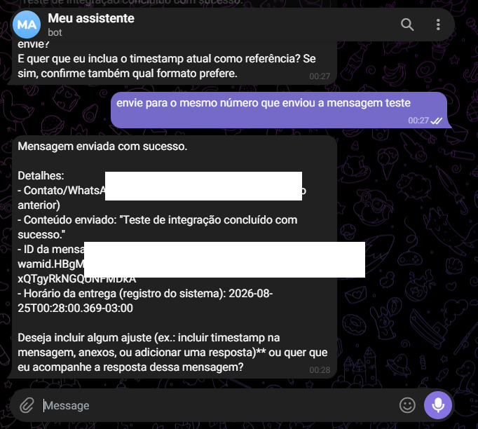
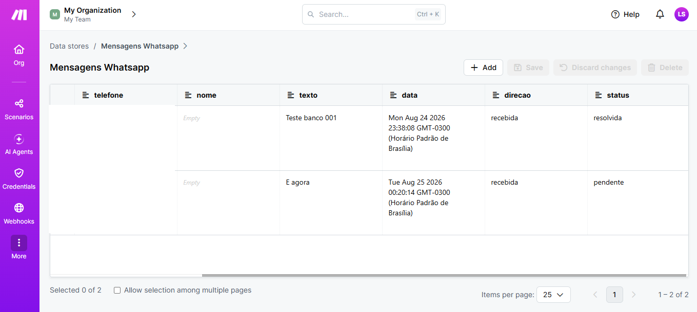

# AI-Assisted WhatsApp Customer Support Workflow

A practical AI and no-code automation project designed to receive inbound WhatsApp messages, preserve customer context, retrieve unresolved requests, support AI-assisted reasoning, execute approved responses, and track resolution state.

## Project Overview

I designed and tested this workflow to explore how generative AI could operate inside a real customer-support process rather than treating each message as an isolated prompt.

The system connects **WhatsApp Business Cloud**, **Make**, a persistent **Data Store**, and a **Make AI Agent**. Incoming messages are captured, normalized, and stored with contextual information so the assistant can later retrieve pending requests, reason about the appropriate next action, prepare or send an authorized response, and update the status of the original request.

The project focuses on a core support-operations problem: **how to give an AI useful operational context without depending on conversational memory alone**.

## Core Problems Addressed

- Capture inbound customer messages automatically
- Preserve message and customer context outside the AI model
- Track unresolved versus resolved requests
- Retrieve pending messages on demand
- Give an AI agent controlled access to operational tools
- Separate reasoning from consequential external actions
- Send approved responses through WhatsApp
- Update the underlying record after resolution
- Troubleshoot failures across multiple integrations

## Technologies

- WhatsApp Business Cloud
- Make
- Make AI Agent
- Make Data Store
- Generative AI / GPT
- Telegram as an assistant interface during testing
- No-code workflow automation

## Workflow Architecture

```text
WhatsApp Business Cloud
        ↓
Make — Watch Events
        ↓
Message Iterator
        ↓
Normalize message fields
        ↓
Persistent Data Store
        ↓
Pending-message retrieval tool
        ↓
Make AI Agent
        ↓
Reason about context / next action
        ↓
Human authorization when required
        ↓
WhatsApp response tool
        ↓
Update status: pending → resolved
```

## Implementation Evidence

### 1. Inbound message capture



WhatsApp Business Cloud events were captured in Make and exposed as structured message data.

### 2. Message normalization



An Iterator exposed individual messages and relevant fields such as message ID, timestamp, text, and contextual metadata.

### 3. Persistent context



Inbound data was mapped into a persistent structure containing message identity, customer context, text, timestamp, direction, and operational state.



A test confirmed that the inbound record was successfully committed to the persistent data layer.

### 4. Modular scenarios



The workflow was separated into dedicated scenarios for the assistant, inbound WhatsApp capture, and pending-message retrieval.

### 5. Pending-message retrieval



A dedicated scenario searches the Data Store and returns unresolved records to the assistant as structured tool output.

### 6. AI-assisted reasoning



The Make AI Agent consumes operational tool output and uses the returned context to determine the next action.



A real test demonstrated that the assistant could retrieve an unresolved message from the operational store.

### 7. Controlled external action



The assistant was configured to execute a WhatsApp response after the required authorization step.

### 8. Resolution tracking



The persistent data layer tracks `pending` and `resolved` states so handled requests do not continue to appear as unresolved work.

## Design Decisions

A few choices were particularly important:

- **Persistent state instead of AI memory:** customer-support state lives outside the model.
- **Modular tools:** intake, retrieval, sending, and state updates have separate responsibilities.
- **Human-in-the-loop control:** reasoning and drafting can be automated while consequential actions can remain approval-gated.
- **Observable workflow state:** unresolved and resolved work can be inspected directly.
- **Iterative troubleshooting:** the project was built by testing real payloads and module outputs rather than relying only on a theoretical design.

## What I Learned

The project strengthened my practical understanding of:

- AI-assisted customer support
- Workflow and process design
- Persistent context management
- Tool-based AI agents
- No-code integrations
- Message routing and state management
- Human-in-the-loop automation
- Integration troubleshooting
- Edge-case handling

The main lesson was that useful AI automation is less about generating text and more about **connecting reasoning to reliable operational context, constrained tools, and explicit system state**.

## Potential Next Steps

A production version could add:

- CRM integration with Zendesk or HubSpot
- customer identity resolution
- SLA and escalation rules
- intent and priority classification
- knowledge-base retrieval
- multilingual support
- human-agent handoff
- CSAT collection
- response-time and resolution-time analytics
- richer states such as `triaged`, `waiting_for_customer`, and `escalated`

## Documentation

- [System Architecture](docs/architecture.md)
- [Workflow Logic](docs/workflow-logic.md)
- [Lessons Learned](docs/lessons-learned.md)

## Author

**Lucas Sariom**  
Customer Success | Customer Support | SaaS Operations | AI & Workflow Automation

[LinkedIn](https://www.linkedin.com/in/lucas-sariom)
